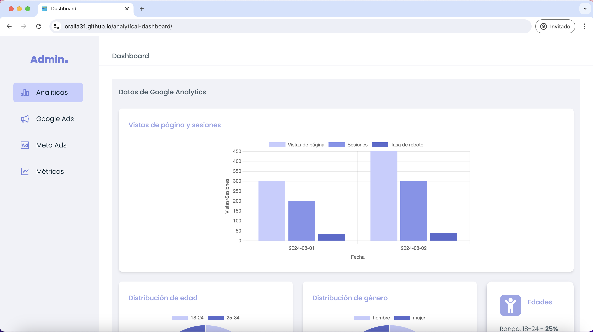
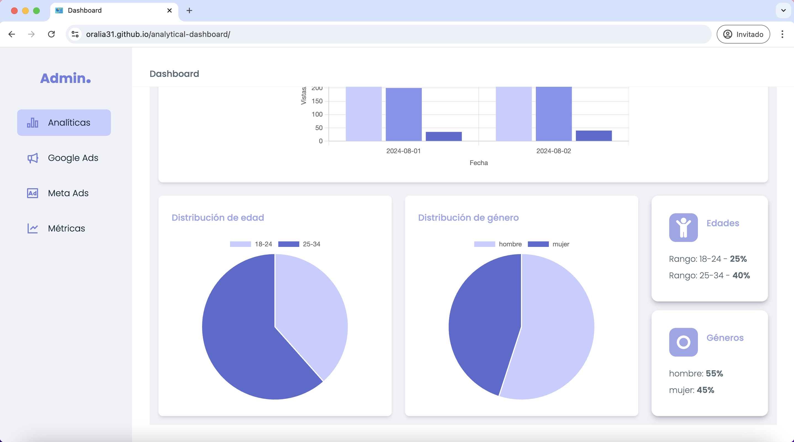
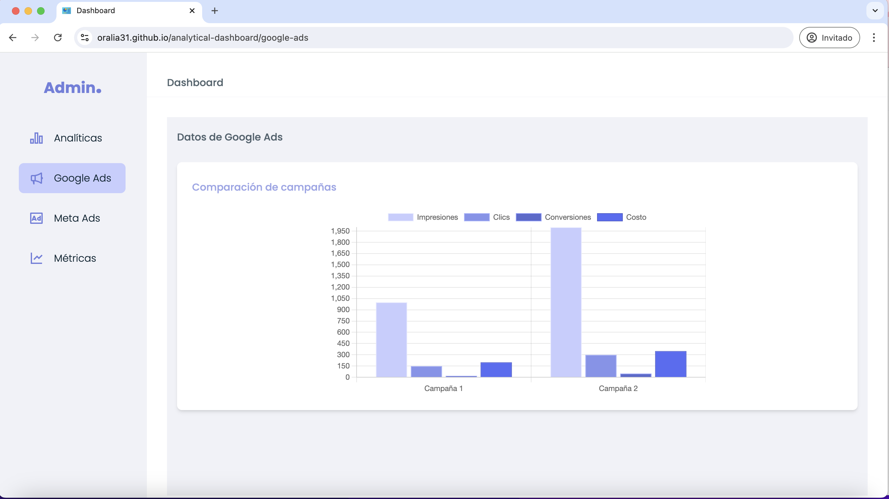
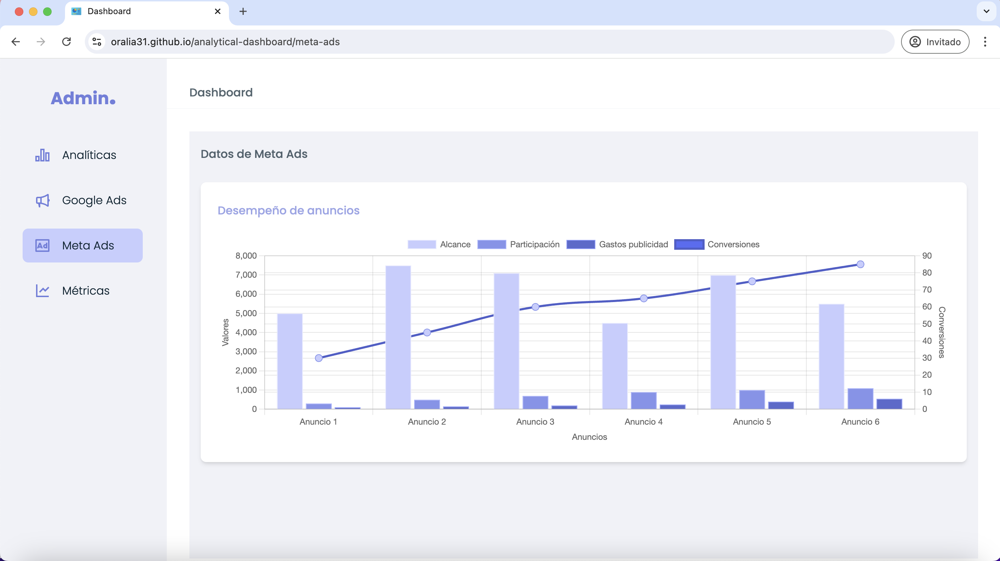
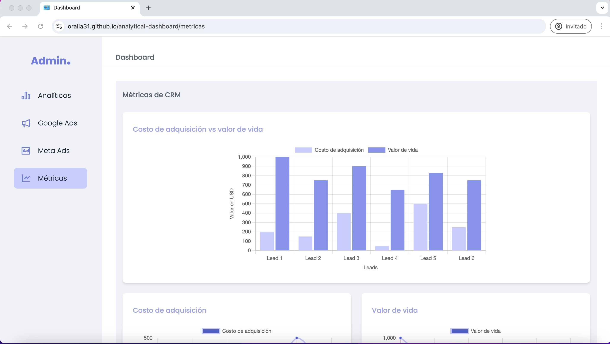
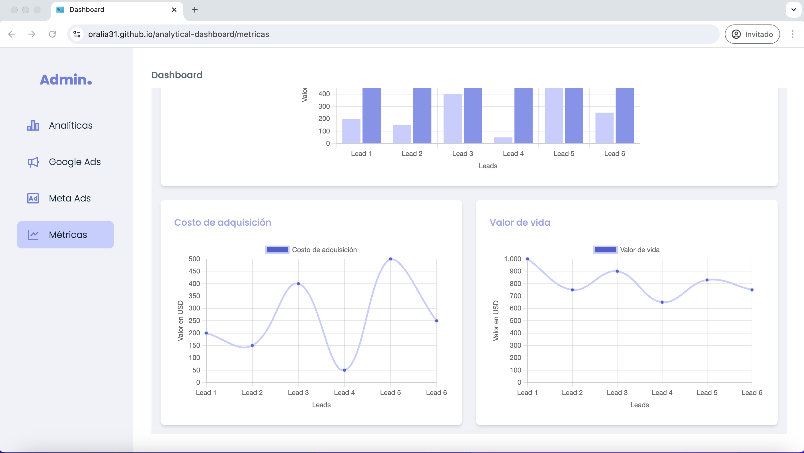
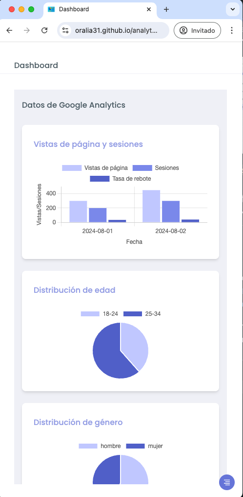
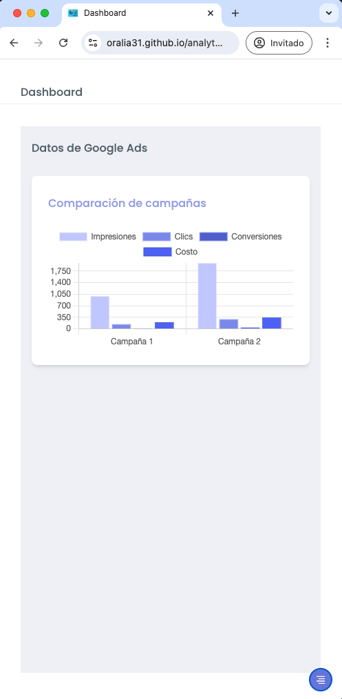
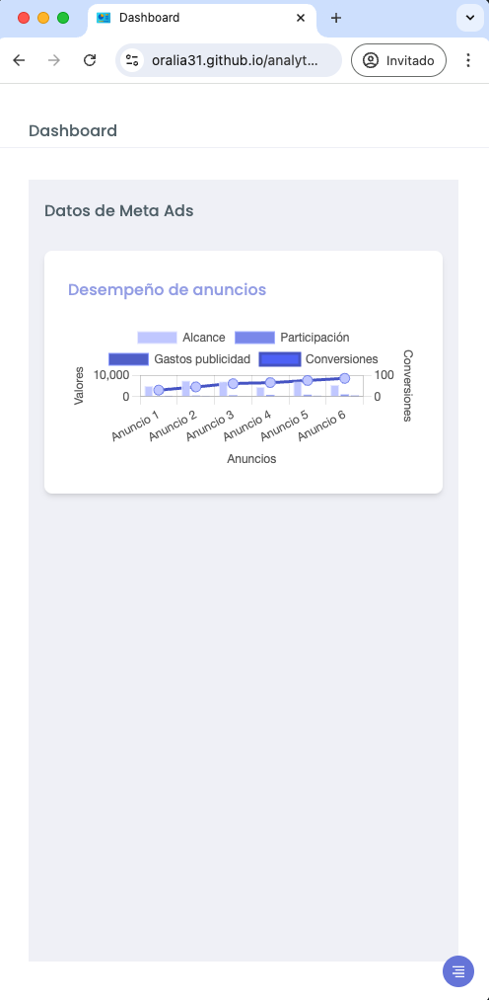
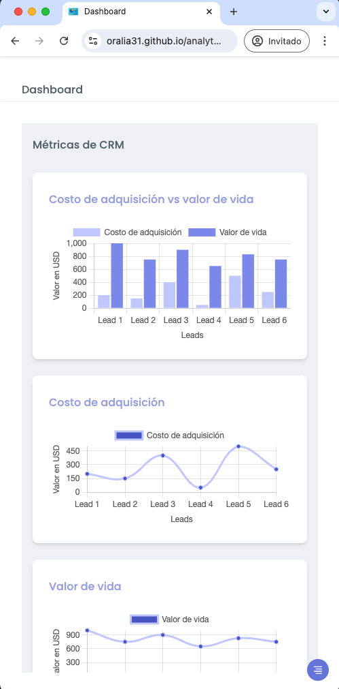

# Dashboard analítico
Este proyecto es un Dashboard interactivo diseñado para presentar información proveniente de multiples API's y JSON estáticos. Utiliza gráficos dinámicos para felicitar la interpretación de los datos.

**Url de la aplicación:** https://oralia31.github.io/analytical-dashboard/


## Tecnologías usadas:
- Lenguajes:`JavaScript, HTML5`
- Framework: `React`
- Estilos: `Tailwind css`
- Empaquetador: `Vite` (en lugar de webpack)
- Icons: `react-icons`
- Router: `react-router-dom`
- Librerías para los gráficos: `chartjs, react-chartjs-2`
- Diseño: `Figma`
- Despliegue: `GitHub Pages`
- Herramientas: `Postman`


## Screenshots
 
 Capturas de pantalla del Dashboard:

`Versión desktop:`














`Versión móvil:`










## Instrucciones de configuración

Para levantar este proyecto en tu máquina local, sigue los siguientes paso:

**1.** Clona el repositorio: https://github.com/Oralia31/analytical-dashboard

**2.** Entra al directorio del proyecto en el entorno de desarrollo de tu preferencia.

**3.** Instala las dependencias con: `npm install`

**4.** Inicia la aplicación con: `npm run dev`


## Deployment

Este proyecto fue desplegado en GitHub Pages.
A continuación dejo las instrucciones de como desplegarlo:

**1. Configuración del archivo `vite.config.js`:**

En este archivo se debe de especificar la base para el repositorio, la cual debe de ser igual al nombre del repo, en este caso el proyecto se llama `analytical-dashboard`, entonces la base se va a llamar así:


```bash
import { defineConfig } from 'vite'
import react from '@vitejs/plugin-react'

// https://vitejs.dev/config/
export default defineConfig({
  server: {
    port: 3000,
  },
  plugins: [react()],
  base: "/analytical-dashboard/" //Se coloca entre diagonales  /

})
```

**2. Intalación de la dependencia `gh-pages`:**

Como siguiente paso se debe de instalar la dependencia `gh-pages` en el proyecto usando:  `npm isntall --save-dev gh-pages`

**3. Configuración del archivo `package.json`:**

Nos dirigimos a ese archivo y buscamos el apartado `"scripts"` y agragamos las instrucciones de `"predeploy"` y `"deploy"`, nos debe de quedar de la siguiente forma:

```bash
 "scripts": {
    "dev": "vite",
    "build": "vite build",
    "lint": "eslint .",
    "preview": "vite preview",
    "predeploy": "npm run build",
    "deploy": "gh-pages -d dist"
  }
```
El `"predeploy"` es el escript que se ejecuta antes de desplegar, para confirmar que la aplicación este contruida.
Y el `"deploy"` publica el contenido de la carpeta `dist` en la rama `gh-pages` del repositorio.

**4. Construcción y despliegue:**

Después de todas la configuraciones anteriores, ahora si procedemos a realizar la construción y despliegue de la aplicación con el comando: 
`npm run deploy`

**5. Configuración de GitHub Pages:**

Como penúltimo paso se debe de verificar la configuración de `Settings` del repositorio de GitHub. Después nos dirigimos a la sección de `Pages` y buscamos el apartado de `Branch`, donde se debe de verificar que la rama seleccionada sea `gh-pages` y que la carpeta seleccionada sea `/root`. Una vez verificado esto se le da clic en `Save` y listo.

**6. Verificación del despliegue:**

Como último paso entrar a la dirección que sale en la parte de arriba y comprobar que el despliegue sea un éxito.

## Contactame
- [Portafolio web ✨](https://oralia-portfolio.vercel.app/)
- [Linkedin 🤩](https://www.linkedin.com/in/oralia-rivera-vicente/)


## Autor
- [@oralia31 ✨](https://github.com/Oralia31)